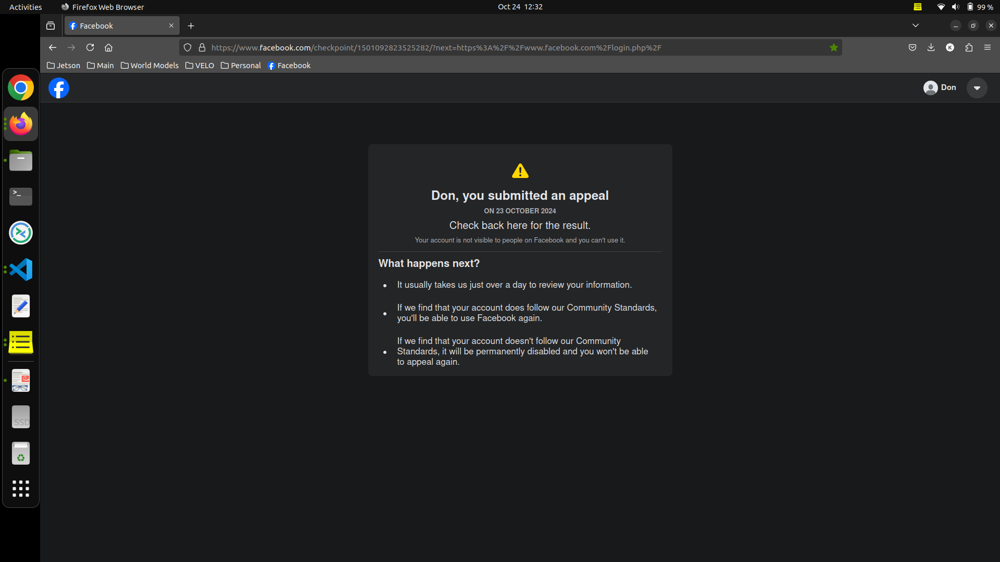

# Facebook Reviews Sentiment Analyzer Chatbot

Created by **Gimhan Dayarathna**, this repository contains the Facebook Reviews Sentiment Analyzer Chatbot to analyze reviews from Facebook pages and extract insights.

## Table of Contents
1. [Environment Setup](#environment-setup)
    1.1. [Conda Environment Creation](#conda-environment-creation)
    1.2. [Dependencies Installation](#dependencies-installation)
2. [Running the Chatbot](#running-the-chatbot)
3. [Facebook Account Ban](#facebook-account-ban)

## 1. Environment Setup

### 1.1. Conda Environment Creation

To create the environment for running this project, use the following commands:

```bash
conda create -n sentiment_chatbot python=3.8
```
```bash
conda activate sentiment_chatbot
```
### 1.2. Conda Environment Creation
```bash
pip install transformers gradio sklearn numpy matplotlib pandas
```

## 2. Running the chatbot

Change the directory to the src from the terminal.

If Facebook page id is provided.
```bash
python3 chatbot_with_page_id.py
```
OR If Facebook page id is **not** provided.
```bash
python3 chatbot_without_page_id.py
```

## 3. Facebook account Ban

Due to unusual activity while trying to activate the Facebook API, the account used to retrieve reviews was banned. As a result, I am currently using locally saved reviews instead of live data from Facebook. The image showing the ban notice is below:

<div align="center">
  <a href="docs/facebook_banned.png">
    
  </a>
</div>
